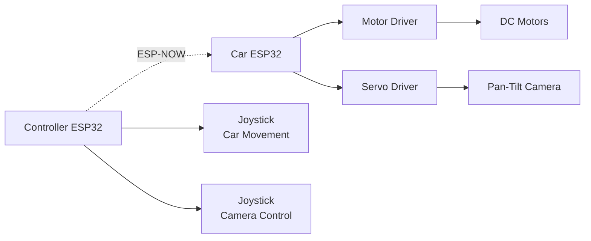

# ESP32 Camera Car with Pan–Tilt Control

A remote-controlled car project based on ESP32, using MicroPython for vehicle and servo control, and Arduino-based firmware for camera streaming.<br>
The system enables real-time movement control and adjustable camera viewing via two servo motors.

## 📖 Table of Contents:

  - Introduction
  - System Overview
  - Features
  - Hardware Components
  - Software & Technologies
  - Installation & Setup
  - How to Use
  - Project Structure
  - Future Improvements
  - Contributors

  ### Introduction
  
This project implements a **remote-controlled vehicle** using an **ESP32 microcontroller**.<br>
The ESP32 runs **MicroPython** to control:
  + Vehicle movement
  + Two servo motors for camera pan and tilt<br>

Due to limitations in MicroPython camera support, camera streaming is implemented separately using Arduino libraries (ESP32-CAM firmware).<br>
This hybrid approach combines the simplicity of MicroPython with the stability of Arduino camera drivers.

  ### System Overview

#### The system consists of two main parts:
- **Control System (MicroPython)**
    + Motor driver control
    + Servo control (pan–tilt)
    + ESP32-NOW
- **Camera System (Arduino)**
    + ESP32-CAM firmware
    + Real-time video streaming via browser
    + Wifi

  ### ✨ Features

✅ Wireless car movement control (forward, backward, left, right)<br>
✅ Camera pan–tilt control using 2 servo motors<br>
✅ Live camera streaming<br>
✅ Modular architecture (Control & Camera separated)<br>

  ### 🛠 Hardware Components
  
| Components                |  Description  |
|:---------|:----:|
| ESP32                     |  Main controller running MicroPython  |
| ESP32-CAM                 |  Camera module OV2640
| Servo Motor x2            |  Camera pan & tilt  |
| Motor Driver (L298N)      |  Controls DC motors  |
| DC Motors + Wheels        |  Vehicle movement  |
| Battery pack              |  Power supply  |
| Pan–Tilt Bracket          |  Mechanical camera mount  |

  ### 💻 Software & Technologies

**Control System:**
  + MicroPython
  + PWM for motors & servos
**Camera System:**
  + Arduino IDE
  + ESP32-CAM Arduino libraries
  + OV2640 camera driver
  + HTTP video streaming server

***⚠️ MicroPython is not used for the camera due to driver limitations.***
  ### ⚙️ Installation & Setup
#### 1️⃣ Flash MicroPython Firmware
  + Download MicroPython for ESP32
  + Flash using esptool.py
```bash
1 esptool.py --chip esp32 erase_flash
2 esptool.py --chip esp32 write_flash -z 0x1000 esp32.bin
```
#### 2️⃣ Upload MicroPython Code
Use:
  + Thonny IDE

Configure:
  + Motor GPIO pins
  + Servo GPIO pins
  + WiFi credentials
#### 3️⃣ Upload Camera Firmware
  + Open Arduino IDE
  + Select ESP32-CAM board
  + Upload Arduino camera web server example
  + Set WiFi SSID & password
  ### ▶️ How to Use
1. Power on the system
2. ESP32_CAM connects to WiFi
3. Check Serial output for IP address
4. Open browser and access:
  - Camera IP → live video stream
5. Adjust camera angle using pan–tilt servos
  ### 📁 Project Structure

  ### 🚀 Future Improvements
🔹 Mobile app control<br>
🔹 Obstacle avoidance (ultrasonic sensor)<br>
🔹 AI-based object detection
  ### 👤 Contributors
+ Trần Nam Minh Việt - 11525062
+ Lê Duy Thịnh - 11525029
+ Bùi Đỗ Khôi  - 11525038


  
  


